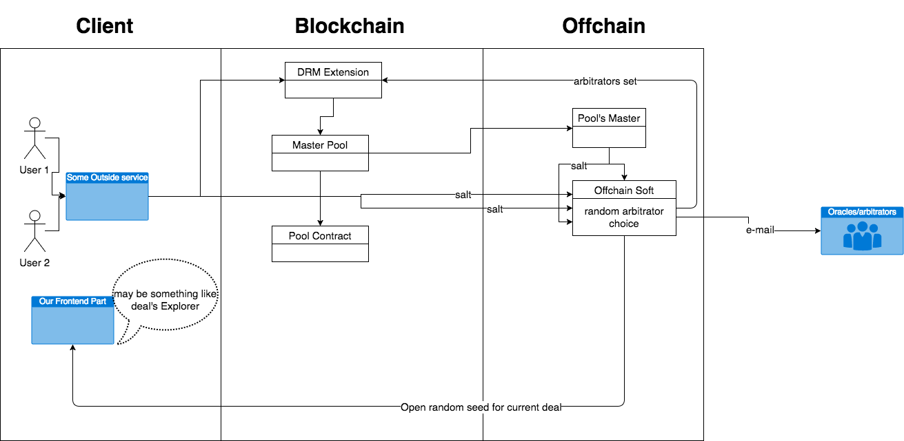
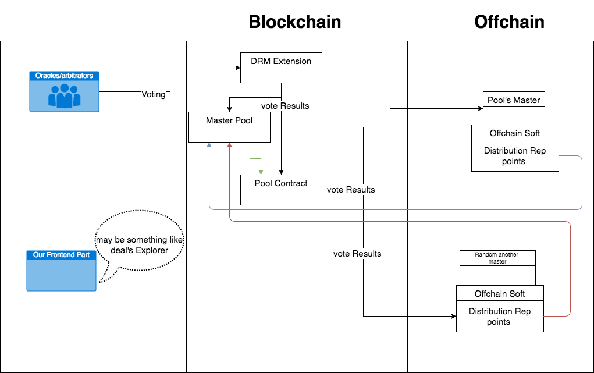

# Forseti

[]

  

1) Пользователи на клиентском сервисе открывают спор, 
2) Клиентский сервис передает информацию о споре на смарт контракт DRM, 
3) Далее запрос отправляется на контракт master pool, где выбирается подходящий пул/ы, 
4) Мастер выбранного пула получает запрос на подбор арбитров для открытой сделки
5) Подбор арбитров осуществляется в офчейне, с использованием соли которую присылают обе стороны сделки и гененерируемая на сервере Мастера пула.
6) Выбранный набор арбитров передается в контракт DRM
7) Все выбранные арбитры получают оповещение о том что они добавлены в сделку

  

1) Арбитры голосуют в контракт DRM
2) Когда голосование кончается результат голосования получает контракт Master Pool и Pool contract
3) Мастер пула,оракулы которого принимали решения,рассчитывает как должна распределиться репутация 
4) Расчет мастера пула проверяется на стороне случайно выбранного мастера любого другого пула
5) Каждый чекпоинт мастера пулов пишут свои расчеты в свой пул и репутация распределяется, также мастера пулов пишут свои проверочные рассчеты во все случайные пулы, сделки которых они проверяли и на контракте проверяется соответствие, в случае если расчеты разнятся, осуществляется дополнительная проверка
